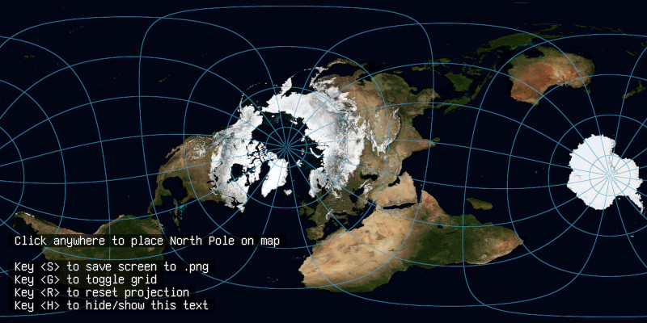

# Screenshot Example

A twisted take on "Hello World": reprojects an [Equirectangular
Projection][wiki-equi] so that the North Pole lands where you click.

You can save the reprojected map to a `.png` file by hitting the <kbd>S</kbd>
key. Saving the current screen contents to an image is done using
`le_screenshot`, for which this is the canonical example.

Note how grid lines are drawn entirely in the shader.

> [!TIP]
> 
> Take a look at `le_screenshot.h` where you find some more information on
> screenshots, and also some hints for saving screenshots (or image sequences)
> in higher bit-per-channel resolutions, and/or formats other than `.png`.

## Techniques used: 

* image loading using `le_resource_manager`
* shader-based reprojection
* fine lines drawn using a fragment shader (see also
  [`exr_decode_example`](../exr_decode_example/))
* `le_debug_print_text` to print on-screen help message

## Build instructions

> [!IMPORTANT]
> 
> This example depends on one external image asset. To keep the Island code
> repository slim, this asset is hosted outside of the repo.

Download image assets via the bash script in the project root folder. 

    ./download_assets.sh

Configure build environment using CMake: 

    mkdir build 
    cd build
    cmake -G Ninja ..

Note that if you are using Qt Creator you may skip manually setting up the
build environment, and simply open the project CMakeLists.txt using Qt Creator.

Build using Ninja:

    ninja

Run application: 

    ./Island-ScreenshotExample

[wiki-equi]: https://en.wikipedia.org/wiki/Equirectangular_projection
